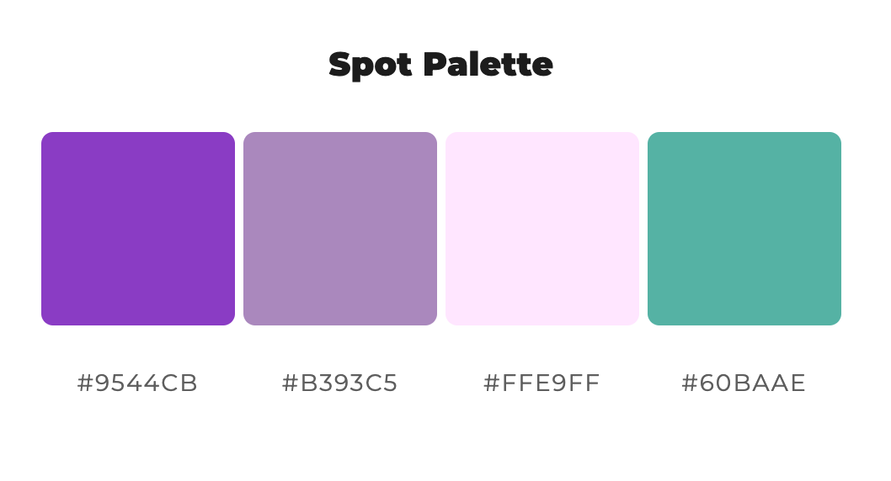
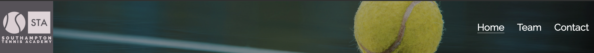
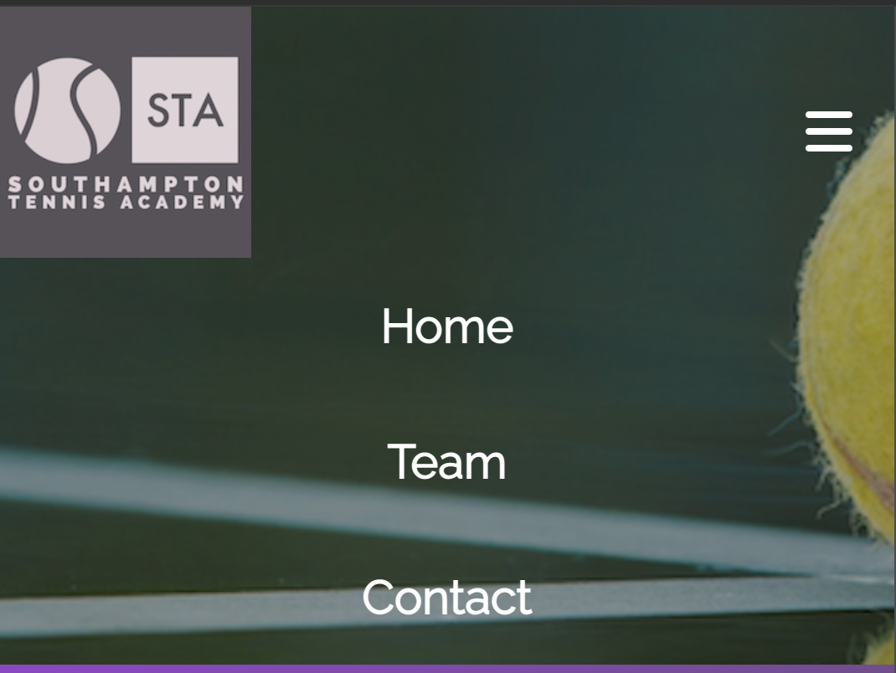

@@ -1,2 +1,159 @@
# **Southampton Tennis Academy**
## **Site Overview**

Southampton Tennis Academy has been designed to fulfil a genuine need for a high-level, accessible and safe tennis environment with state of the art facilities in the Southampton area of the UK.

Whilst there are numerous clubs within the county and region, they are often big-business, money-orientated centres or smaller clubs with inadequate coaching and competition programmes not to mention a lack of facilities which make training all year round a real challenge.

The ideology behind STA is to provide an amazing setting with high-calibre coaches and support staff who are all committed to developing tennis players of all ages and abilities. The centre is new so the site's purpose is to generate awareness within the local and wider community, whilst trying to make it clear that the philosophy is to put the prospective player at the centre of everything irrespective of their age or level.

​
## Table of contents:
1. [**Site Overview**](#site-overview)
1. [**Planning stage**](#planning-stage)
    * [***Target Audiences***](#target-audiences)
    * [***User Stories***](#user-stories)
    * [***Site Aims***](#site-aims)
    * [***Wireframes***](#wireframes)
    * [***Color Scheme***](#color-scheme)
    * [***Typography***](#typography)
1. [**Current Features Common to all pages**](#current-features-common-to-all-pages)
    * [***Header Element***](#header-element)
    * [***Other Features***](#features)
    * [**Footer**](#footer)
1. [**Individual Page Content features**](#individual-page-content-features)
    * [**About Page Content**](#about-page-content)
    * [**Teachings Page Content**](#teachings-page-content)
    * [**Community Page Content**](#community-page-content)
    * [**Contact Page Content**](#contact-page-content)
    * [**Form Feedback Page Content**](#form-feedback-page-content)
1. [**Future-Enhancements**](#future-enhancements)
1. [**Testing Phase**](#testing-phase)
1. [**Deployment**](#deployment)
1. [**Tech**](#tech)
1. [**Credits**](#credits)
    * [**General reference**](#general-reference)
    * [**Content**](#content)
    * [**Media**](#media)
    * [**Honorable mentions**](#honorable-mentions)
​
## **Planning Stage**

### **Target Audiences:**
* People who are interested in tennis​.
* Parents looking for somewhere safe and professional their children can train.
* Adults who wish to develop their tennis or compete at a new, exciting facility.
* Beginners who are looking for a friendly environment in which to learn the game.
* High level players looking for a training base between tournaments.

​
### **User Stories:**
* As a user, I want to see what facilities the academy boasts.
* As a user, I want to learn about the philosophy of the academy.
* As a user, I want to navigate the page to find what I require quickly and easily.
* As a user, I want to learn more about the coaches and what they offer.
* As a user, I want to reach out and contact the academy.
* As a user, I want to know how to find the academy.
* As a user, I want to find and follow the academy on social media.

​
### **Site Aims:**
* To raise awareness of the new centre and its philosophy.
* To provide an opportunity for the user to see profiles of the coaching team.
* To offer the user an oppertunity to get in contact.
* To provide a contact form the user can complete if they would rather not email or contact via social media.
* To show the location of the centre via a map and address.

​​
### **Wireframes:**

Wireframes for each page were created using Balsamiq.

* Home Page
[Home Page Wireframe](docs/images/home-wireframe.png)

* Team Page
[Team Page Wireframe](docs/images/team-wireframe.png)

* Form Page
[Form Page Wireframe](docs/images/form-wireframe.png)

 ​

### **Color Scheme:**
​
I used online palette generator ColorSpace to generate the following:

 

I wanted to evoke similarities to the Wimbledon colours which are purple and green. I found that the purple shades worked very well within the site so chose to substitute the greens for images with significant amounts of green in them. I had to use white #fff in the header to provide suitable contrast to the background image. I used a grey #575359 as a neutral shade which worked well with the other colours across the site. I also used this as the colour for the footer and some of the text. In the form section I used a yellow #e7df49 a) to provide contrast and b) because it was the closest I could get to the colour of a tennis ball.

​
### **Typography**
​
* Throughout the page, the following fonts are used:
  * Raleway ('https://fonts.googleapis.com/css2?family=Raleway&display=swap') - I had already created a logo which used this font so I wanted to use it throughout the site. I felt that this font offered a clean and modern look which suits the new academy.
  * Sans serif - As a fallback font in the event Raleway wasn't supported by the browser
​
* All fonts were sourced from Google fonts, as stated in the credits.

​ 

## **Current Features Common to all Pages**
​
#### **Navigation Bar:**
​
* The STA logo is present on the left side of the header and the navigation links are aligned to the right. The background image depicts a fetching image of a tennis ball on a court.
* The user is given links to the home, team and contact pages.
* Each navigation link features a hover effect too provide visual feedback to the user.
* Each page features an active link to provide instant feedback to the user as to their location on the site.
* The header is fully responsive and uniform across all three pages of the site thanks to a flex display.
* On smaller screens a hamburger menu is provided to ensure mobile users have an optimal experience.
* 
* 

#### **Footer:**

* The footer contains social media link and a clickable email link so the user can contact the academy
* The footer is responsive and the icons all shrink on smaller screens
* [Screenshot of footer](docs/images/footer.png)
* [Screenshot of responsive footer](docs/images/footer-responsive.png)
​

## **Features**
​
#### **Home Page** 

* The h1 heading features a gradient background colour from top left to bottom right using the purple and gray that is prominent throughout the site (outlined in the colours section). The font size reduces depending on the width of the screen it is being viewed on.
* The main focus of the page is the hero image. This shows two young girls talking by the net on a tennis court. There is an animation which adds a 6 second zoom effect upon the page loading.
* This image was chosen to fit the Wimbledon-esque colour scheme of the website. The two girls are both smiling which helps to create the image of the academy being a safe and friendly place for children.
* There is a text-box placed in line with the first girl's line of sight to give the illusion that she is looking towards it. This was designed to draw the user's attention to the box which lists the facilities of the academy. At the bottom of the list is a ink which takes the user to the contact form page.
* The philosophy section outlines the core beliefs of the academy. The emphasis here is very much on the player and their long-term development being at the centre of everything. It introduces three core principles which are central to the programmes on offer. For consistency, this section features the same gradient background as the h1 heading.

* The programme section elaborates on the core principles of competition, coaching and practice. The important message to convey is that there is more to the academy than just coaching. There is a comprehansive competetition programme involving team events and leagues, singles and doubles and rankings tournaments for all ages and abilities. Practice is also an essential ideology at the academy and players as it is recognised that this is often where a lot of the hard work is done.
* This section is split into three divs which sit side by side but stack one on top of the other on smaller screens. In the headings for each div I used relevant icons from Font Awesome which help to reinforce what each one is about.

  

#### **Team Page** 

* The team page uses the same h1 heading, responsiveness and background gradient as the home page for the purpose of consistency.
* The main focus of this page are the photos of the three coaches and their corresponding short biographies. Similar to the home page, these are placed side by side but will stack on top of each other when the screen width is reduced. 
* For consistency purposes, the background color of the bios remains true to the overall color palette of the site overall.

 

#### **Contact Form Page**

* The contact page features a background image of an elderly gentleman playing tennis. There is a significant amount of green in this image which fits well with the chosen colour scheme. On top of the image and positioned to the left of the page is a contact form which features a name input, date of birth input, email input, radio buttons, checkboxes, a dropdown menu and a submit button. The purpose of the form is to give the user an opportunity to contact the academy and provide information about which type of coaching they are interested in, as well as to specify their own previous playing experience, if any. The colours are consistent throughout using those which are used across the site as a whole.

* The next section features the academy's address placed next to a map showing its location. I have used the same gradient background on the headings and on smaller screens the two divs will sit on top of ecah other.
​
## **Future-Enhancements**
​
There are a number of improvements which the business would like implemented:
​
* A link allowing the user to call the academy from mobile devices
* Access to a user account in order to make court bookings or book and pay for sessions with a coach 
* The ability to view the coaching programme and book on to and pay for courses online
* A further page with details of team fixtures and how the user can contact the various captains
* A gallery page showing members and other staff at the facility
​
## **Testing Phase**
​
**Responsiveness**
* Responsiveness was tested extensively using Chrome Dev Tools. This proved invaluable when creating each page and was instrumental in helping me ensure responsiveness on multiple devices and screen sizes. The ability to experiment with the code saved a lot of trial and error within gitpod.
* User testing was conducted on the following devices: Apple iPhone 12, Apple iPad Air 2021, Apple Macbbok Air 2021, Apple iMac 2021. 
* As I was limited to Apple devices only I sent the link to various friends and colleagues so they could check responsiveness on further devices including Windows desktop PCs, Amazon tablets and Samsung Galaxy S12. In each case, the pages responded as expected.
​

**Functionality**

* Each feature was user-tested numerous times. All links were clicked and inages checked.
* The header is responsive and each of the links and hamburger menu function as desired. 
* The javascript behaves as expected regardless of the device. 
* The social media links within the footer all work as expected on all pages, taking the user to the relevant link in a new tab. 
* The contact link within the cover-text takes the user to the contact page when clicked. 
* On the contact page the form inputs and validation works as expected. 
* The Google map on the same page also functions properly. 
* I used *Lighthouse* to test each page. Results below:
* [Home page](docs/images/home-lighthouse.png)
* [Team page](docs/images/team-lighthouse.png)
* [Contact Form page](docs/images/form-lighthouse.png)
* The site performs well in most areas although the Google Maps iframe on the contact page appears to 

​
**Validators**

* HTML Validation using w3c validator - Each page passed validation

* [Home page](docs/images/home-html-check.png)
* [Team page](docs/images/team-html-check.png)
* [Contact Form page](docs/images/form-html-check.png)

* CSS Validation using w3c jigsaw - Each page passed validation

* [Home page](docs/images/home-css-check.png)
* [Team page](docs/images/team-css-check.png)
* [Contact Form page](docs/images/form-css-check.png)

* JavaScript Validation using jShint - Code passed validation

* [JavaScript code report](docs/images/jshint-report.png)

​
​
## **Bugs**
​
The following bugs were identified during user testing:

* 🐞 - When on mobile the team page coach bios failed to align properly
* ⚒️ - There was an open div tag in the html code
* ✅ - Added the relevant closing tag to make the coach bios respond properly

 

* 🐞 - The contact form contained a bug where it was possible to submit the form without providing a valid email address
* ⚒️ - The input type had been set to text
* ✅ - Change input type to email so a valid email address was required. The input was re-tested after the bug was fixed and the issue was resolved.

​ 

* 🐞 - The contact form would not submit unless 'individual coaching' was selected 
* ⚒️ - The input type had been set to 'required'
* ✅ - Remove the required attribute so the user did not have to select this option. This fixed the issue and upon re-testing the user would not have to select this option.

 

## **Unfixed Bugs**

* There are no known unfixed bugs at this stage but this section has been added to catalogue future bugs.

***
## **Deployment**
I deployed the page on GitHub pages via the following procedure: -
​
1. From the project's [repository](pageurl), go to the **Settings** tab.
2. From the left-hand menu, select the **Pages** tab.
3. Under the **Source** section, select the **Main** branch from the drop-down menu and click **Save**.
4. A message will be displayed to indicate a successful deployment to GitHub pages and provide the live link.
​
You  can find the live site via the following URL - [live webpage](https://andypsheridan.github.io/sta-final/)

***
​
## **Tech**
​
I used the following technologies for the STA project:
​
- HTML
- CSS
- JavaScript

## **Software**

The following software was used:

- Gitpod to create, load and push my code to Github.
- Git (Gitpod and Github) as my version control for the site.
- Adobe Express to create the STA logo.
- Balsamiq wireframes software.
​

 

## **Credits**
### **Honorable mentions**

* Thank you to my mentor, Richard Wells, who gave a significant amount of his time to provide me with feedback and ideas on the project; he has been invaluable in so many ways and a genuine source of motivation for me.
* Thanks to the Code Institute community on Slack who helped remind me that everyone has difficult days.
* A huge thank you to my partner Jess who now knows more about HTML and CSS than she ever wanted to.
* Finally, thanks to my two boys, Arthur and Elijah who think one day I'll build the new MarioKart.
​
### **Content:**

* JavaScript code taken from YouTube user 'Well Explained'. To help with the responsive navbar I used code from the following YouTube video: https://www.youtube.com/watch?v=qSp5C0OOMns
At the time I had no knowledge of JavaScript so used the exact JS code featured in the video. The rest of the header is loosely based on their example but adapted for the needs of the academy.​

Here is the code used:

const toggleButton = document.getElementsByClassName('navbar-toggle')[0];
const navbarLinks = document.getElementsByClassName('navbar-links');
toggleButton.addEventListener('click', function() {
    for(var i=0; i<navbarLinks.length; i++)
    navbarLinks[i].classList.toggle('active');
});

* Social media and email icons from https://fontawesome.com/

* The contact form is loosely based on Code Insitute's Love Running walkthrough project.

### **Media:**

The logo STA was created using Adobe Express.
​
The following images were used, all acquired from public domain image site Pexels.com:

* https://images.pexels.com/photos/5069180/pexels-photo-5069180.jpeg?auto=compress&cs=tinysrgb&w=800
* https://images.pexels.com/photos/1277397/pexels-photo-1277397.jpeg?auto=compress&cs=tinysrgb&w=800
* https://images.pexels.com/photos/5741044/pexels-photo-5741044.jpeg?auto=compress&cs=tinysrgb&w=800
* https://images.pexels.com/photos/6292759/pexels-photo-6292759.jpeg?auto=compress&cs=tinysrgb&w=800
* https://images.pexels.com/photos/8224730/pexels-photo-8224730.jpeg?auto=compress&cs=tinysrgb&w=800
* https://images.pexels.com/photos/2339377/pexels-photo-2339377.jpeg?auto=compress&cs=tinysrgb&w=800

### **Honorable mentions**
* Thank you to my mentor, Richard Wells, who gave a significant amount of his time to provide me with feedback and ideas on the project; he has been invaluable in so many ways and a genuine source of motivation for me.
* Thanks to the Code Institute community on Slack who helped remind me that everyone has difficult days.
* A huge thank you to my partner Jess who now knows more about HTML and CSS than she ever wanted to.
* Finally, thanks to my two boys, Arthur and Elijah who think I'm off working on a better Mario Kart.